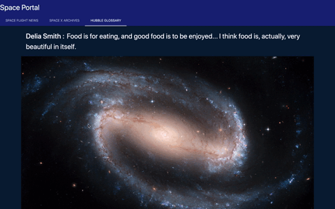

# SPACE PORTAL

This is a application where you can access data related to space. You can see when the next space launches will be, browse the hubble glossary and find the description to a term you don't know.
You can look at recent news aobut anything space. This application is powered by the [OpenWeather API](https://openweathermap.org/api) to retrieve weather data for cities.

The following image demonstrates the application functionality:



## Client Scope

>User Story

```
AS A USER WITH A CURIOSITY FOR SPACE
I WANT to see INFO RELATED TO SPACE ENDEAVORS  
SO THAT I can read NEWS ABOUT THE NEXT SPACE LAUNCH IS! 
```

> Project Mvp

```
1. application must use two server-side APIs.
2. Must use a CSS framework *other than Bootstrap! Gasp!* 
3. least one third-party API 
4. Must have a polished, mobile-first UI 
5. Must meet good quality coding standards 
6. NOT use alerts, confirms, or prompts 
7. deployed to GitHub Pages
8. Must be interactive 
```


## Contributors

> Erik De Luna ~ js Developer 
> Dale Kittendorf ~ js Developer
> Jonathan Bentley ~ html, css Developer
> Trey Perry ~ html, css Developer

## Links

> You can view the application here: https://codingerik.github.io/totallyNotTheDarkSide/
>
> This is the Repo for the application: https://github.com/CodingErik/totallyNotTheDarkSide
